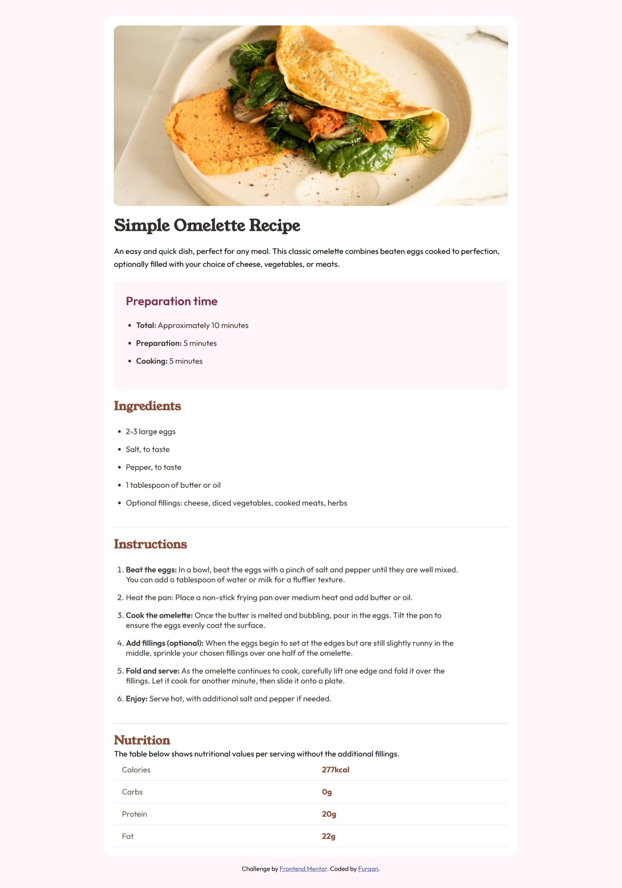
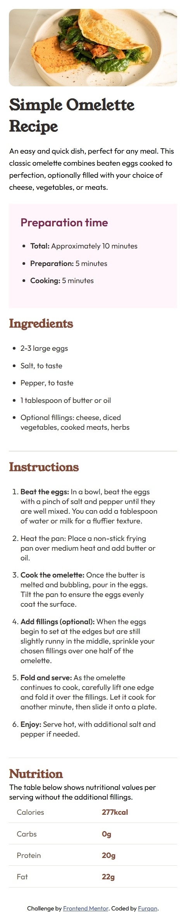

# Frontend Mentor - Recipe page solution

This is a solution to the [Recipe page challenge on Frontend Mentor](https://www.frontendmentor.io/challenges/recipe-page-KiTsR8QQKm). Frontend Mentor challenges help you improve your coding skills by building realistic projects. 

## Table of contents

- [Overview](#overview)
  - [Screenshot](#screenshot)
  - [Links](#links)
  
  - [My process](#my-process)
  - [Built with](#built-with)
  - [What I learned](#what-i-learned)
  - [Author](#author)

**Note: Delete this note and update the table of contents based on what sections you keep.**

## Overview

### Screenshot
Here are some screeshots

**Desktop**

**Mobile**

### Links

- Solution URL: [Solution URL (GitHub): ](https://github.com/furqan7m3-ops/recipe-page-main-html-css)
- Live Site URL: [Live site URL here](https://recipe-page-main-html-css.vercel.app/)

## My process

I started out this project by defining its HTML structure first then I added class naming to it and then I approached with CSS for styling. While adding styling to it I used the mobile-first approach.

### Built with

- Semantic HTML5 markup
- CSS custom properties
- Mobile-first workflow

### What I learned
While implementing this project I learnt how to use the mobile-first approach.

## Author
- Frontend Mentor - [Furqan Ahmad](https://www.frontendmentor.io/profile/furqan7m3-ops)